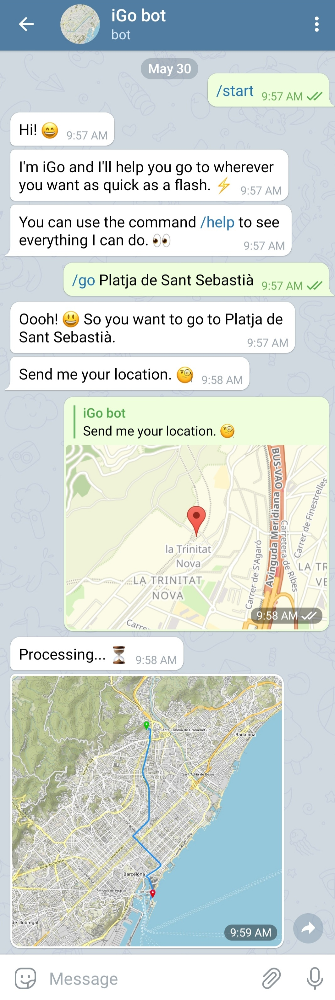

# iGo

This is a project composed of two parts: the Python `igo` module, and the Telegram iGo bot, which are both
designed to work with data of the city of Barcelona.

## iGo Telegram bot

The iGo Telegram bot shows users the most intelligent way of driving from their current location to their
desired destination using the concept of *itime*, which is calculated using the `igo` module.

The bot supports the following commands:
 - `/go [destination]`: Shows the user a map with the fastest way to go from their current location to
   the specified destination. 
 - `/where`: Shows the user a map with their current location.
 - `/setlang [language code]`: Sets the bot's language.
 - `/author`: Shows who has developed the bot.
 - `/help`: Shows a list of the available commands and what are they used for.
 - `/pos [location]`: Changes the user location to the specified one (intended for development).

The iGo bot is available in three different languages: Catalan, Spanish and English, and it is easy
to add support for more! The translations of the shown messages are handled by the `translations` 
module, which is an additional subcomponent developed in this project.

### Example of use

An example of how the bot can be used to search a path from the user's current location to
"Platja de Sant Sebastià" can be seen in the following screenshot:

  

## Running the bot

To run the bot, you need to have [Python](https://www.python.org/) installed on your computer,
and the [Telegram](https://telegram.org/) app installed on your phone.

Then, to create a bot, you have to obtain an *Access token*, an identifieer that Telegram provides for
your bot. To do so, open Telegram, visit the [@BotFather](https://telegram.me/botfather), execute the
command `/newbot` and give him all the information he asks. Finally, he will give you a code (the Access
token), copy it and save it in a file named `token.txt`. Put this file in the main directory of the project.

After that, it's time to run the bot! On your computer, open a terminal, change the directory to the
main directory of the project and execute the following commands:

    python3 -m venv venv
    . venv/bin/activate
    pip3 install -r requirements.txt 
    python3 bot.py

This will create a virtual Python environment, install the required packages, and execute the bot.
The first time you run it, it will have to process the internal data used, so it will take some
time. After loading all the data, you will see the message `Bot running!`. Now every Telegram user can
talk to your bot!

To stop the bot, enter `Ctrl+C` on the terminal in which you have the bot running.

## `igo` module

iGo is a Python module that lets you create igraphs ("intelligent graphs"). What makes them intelligent is
that their edges have an attribute called itime ("intelligent time"), which takes into account the 
length, the maximum driving speed and the current traffic data of a road, plus the time it takes to
turn depending on the angle and the side of this turn.

The module contains all the functions and data structures needed for acquiring and storing data
(the street network graph and the traffic data), building igraphs, searching ipaths ("intelligent 
paths"), and plotting different information into a map.

For more information about the internals of the module, see the docstrings of the code.

## Credits

This project has been developed with ❤️ by Marçal Comajoan Cara and Laura Saéz Parés, two students of the
Universitat Politènica de Catalunya (UPC), for the Algorithmics and Programming II subject of the Data
Science and Engineering Degree.

The project specification can be found in https://github.com/jordi-petit/ap2-igo-2021.

## License

Copyright © 2021 Marçal Comajoan Cara and Laura Saéz Parés.

This project is available under the terms of the GNU General Public License, version 3. See [LICENSE.md](LICENSE.md)
for more information.

